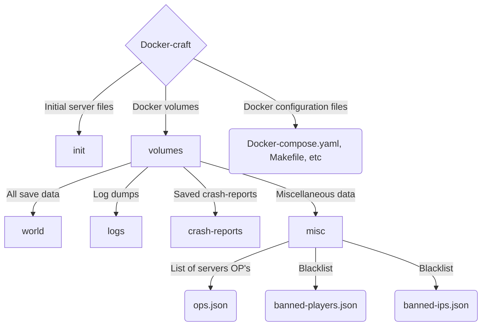

# Docker-craft

## Actual Minecraft version is **1.20.4**

## About
Docker-craft is just a simple ready repo to quickly enroll  new java Minecraft server inside of a Docker container on GNU-Linux.

Main ideas here are the simplicity and full transparency.


|[Installation](#Installation)|
|:---:|
|[Usage](#Usage)|
|[File structure](#File structure)|


## Installation
### 1) Check dependencies:
Make sure to have this packages installed on your system:
- Docker
	You can find full installation manual here:
	https://docs.docker.com/desktop/install/linux-install/

- Docker compose
	You can find full installation manual here:
	https://docs.docker.com/compose/install/

- make
	```bash
	# For Debian based distributions.
	
	sudo apt install make -y
	```
	```bash
	# For RPM based distributions
	
	sudo yum install make
	```

- wget
	```bash
	# For Debian based distributions.
	
	sudo apt install wget -y
	```
	```bash
	# For RPM based distributions
	
	sudo yum install wget
	```

### 2) Clone repo
Just clone this repository.
```bash
git clone https://github.com/Molniyax/docker_craft.git
```

### 3) Set up server configurations
- **server.properties**
	Main config file for Minecraft server.
	Located here:
	```Location
	init/server.properties
	```
	
	Here you'll find different options, such us game difficulty level, spawn protection, game mode and etc.
	 
	Do **NOT** edit server port in this file!
	
	You can find more information here:
	https://minecraft.fandom.com/wiki/Server.properties

- **example.env**
	Located in root of repo:
	```location
	example.env
	```
	
	Here you need to set username and UUID of the first server OP, this is important step, because you wan't have full access to the server's console due lack of full interactive mode.
	
	Please pay attention to the fact, that UUID will be different in online-mode server and offline-mode one.
	
	Also here you can change name of the container and server port.

### 4) Initialize project via make
Just execute this command from the root of the repo:
```bash
make init
```


## Usage
### Basic commands
To **start** or restart your server use:
```bash
make start
```

To **stop** it use: 
```bash
make stop
```

### Additional controls
To see server **logs** use:
```bash
make logs
```
Logs will appear on screen and will follow server execution until **Ctrl+C** is pressed.

To start server in **semi-interactive** mode use:
```bash
make start_it
```
Server will work until **Ctrl+C** is pressed.


## File structure




